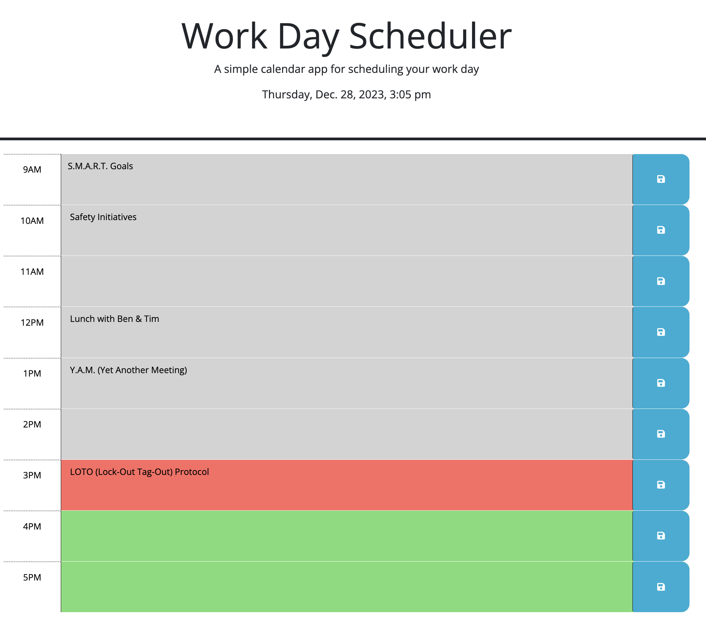

# Work-Day-Scheduler

## Description

This REPO was designed to be a simple calendar application that allows a user to save events for each hour of a typical work day (9AM-5PM) by modifying starter code. This also utilizes the Day.js library to work with date and time.

[Work-Day Scheduler](https://theoarsman.github.io/Work-Day-Scheduler/)

## Table of Contents

- [Work-Day-Scheduler ](#work-day-scheduler) 
- [Description](#description) 
- [Table of Contents](#table-of-contents) 
- [User Story](#user-story) 
- [Acceptance Criteria](#acceptance-criteria) 
- [Usage](#usage) 
- [Contributing](#contributing) 
- [License](#license) 
- [Tests](#tests) 
- [Resources](#resources) 
- [Questions/Contact](#questionscontact)

## User-Story

**AS AN** employee

**I WANT** to add important events to a daily planner

**SO THAT** I can manage my time effectively

## Acceptance-Criteria

**GIVEN** I am using a daily planner to create a schedule 

**WHEN** I open the planner 
**THEN** the current day is displayed at the top of the calendar

**WHEN** I scroll down 
**THEN** I am presented with timeblocks for standard business hours of 9AM-5PM

**WHEN** I view the timeblocks for that day 
**THEN** each timeblock is color coded to indicate whether it is in the past, present, or future

**WHEN** I click into a timeblock 
**THEN** I can enter an event

**WHEN** I click the save button for that timeblock 
**THEN** the text for that event is saved in local storage

**WHEN** I refresh the page 
**THEN** the saved events persist

## Usage

Copy/paste the web address. Click the text box for the corresponding time you want to block out an event, then begin typing. Once you are done, click the save button. Repeat this for all hour blocks you want an event to take place, making sure to click save for each block of time which text was entered.

Make sure the web address is still coppied. Close the web page. Paste the web address in tne navigation bar and reopen the page. Your events will still be saved (as long as your cliked the save button after editing).

## Contributing

None

## License

Copyright (c) 2023 Heinz Ulrich V

## Tests

None

## Resources

None

## Questions/Contact

**Developer:** Heinz Ulrich V

**Developer:** Heinz Ulrich V

 

 

 

